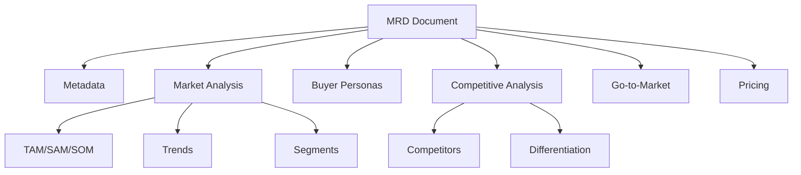

# MRD (Market Requirements Document)

The MRD defines market opportunity, target segments, and go-to-market strategy.

## Purpose

An MRD answers:

- What market opportunity exists?
- Who are the target buyers?
- How does our solution compare to alternatives?
- What's the go-to-market strategy?

## Structure



## Core Sections

### Market Analysis

```go
type MarketAnalysis struct {
    TAM         MarketSize   `json:"tam"`           // Total Addressable Market
    SAM         MarketSize   `json:"sam"`           // Serviceable Addressable Market
    SOM         MarketSize   `json:"som"`           // Serviceable Obtainable Market
    Trends      []Trend      `json:"trends"`
    Segments    []Segment    `json:"segments"`
    GrowthRate  string       `json:"growth_rate,omitempty"`
}

type MarketSize struct {
    Value       float64 `json:"value"`
    Currency    string  `json:"currency"`
    Year        int     `json:"year"`
    Source      string  `json:"source,omitempty"`
    Description string  `json:"description,omitempty"`
}
```

### Buyer Personas

```go
type BuyerPersona struct {
    ID              string   `json:"id"`
    Name            string   `json:"name"`
    Title           string   `json:"title"`
    Company         string   `json:"company_type"`
    BudgetAuthority bool     `json:"budget_authority"`
    DecisionRole    string   `json:"decision_role"` // Decision Maker, Influencer, User
    Motivations     []string `json:"motivations"`
    Objections      []string `json:"objections"`
    Channels        []string `json:"channels"`
}
```

### Competitive Analysis

```go
type CompetitiveAnalysis struct {
    Competitors    []Competitor `json:"competitors"`
    Differentiation string      `json:"differentiation"`
    PositioningMap string       `json:"positioning_map,omitempty"`
}

type Competitor struct {
    Name       string   `json:"name"`
    Category   string   `json:"category"` // Direct, Indirect, Substitute
    Strengths  []string `json:"strengths"`
    Weaknesses []string `json:"weaknesses"`
    Pricing    string   `json:"pricing,omitempty"`
    MarketShare string  `json:"market_share,omitempty"`
}
```

### Go-to-Market

```go
type GoToMarket struct {
    Strategy        string   `json:"strategy"`
    Channels        []string `json:"channels"`
    LaunchTimeline  string   `json:"launch_timeline"`
    TargetSegments  []string `json:"target_segments"`
    Messaging       Messaging `json:"messaging"`
    SalesEnablement []string `json:"sales_enablement,omitempty"`
}

type Messaging struct {
    ValueProposition string   `json:"value_proposition"`
    Tagline          string   `json:"tagline,omitempty"`
    KeyMessages      []string `json:"key_messages"`
}
```

## Creating an MRD

```go
import "github.com/grokify/structured-requirements/mrd"

doc := &mrd.Document{
    Metadata: mrd.Metadata{
        ID:      "MRD-2025-001",
        Title:   "Enterprise Analytics Market",
        Version: "1.0.0",
        Status:  mrd.StatusDraft,
    },
    MarketAnalysis: mrd.MarketAnalysis{
        TAM: mrd.MarketSize{
            Value:    50000000000,
            Currency: "USD",
            Year:     2025,
            Source:   "Gartner 2024",
        },
        Trends: []mrd.Trend{
            {Name: "AI/ML Integration", Impact: "High"},
        },
    },
    BuyerPersonas: []mrd.BuyerPersona{
        {
            ID:              "BP-1",
            Name:            "Data-Driven Director",
            Title:           "Director of Analytics",
            DecisionRole:    "Decision Maker",
            BudgetAuthority: true,
        },
    },
    CompetitiveAnalysis: mrd.CompetitiveAnalysis{
        Competitors: []mrd.Competitor{
            {Name: "Competitor A", Category: "Direct"},
        },
        Differentiation: "Only solution with real-time insights",
    },
}

mrd.Save(doc, "analytics-market.mrd.json")
```

## Validation

```go
result := mrd.Validate(doc)
if !result.Valid {
    for _, err := range result.Errors {
        fmt.Printf("Error: %s\n", err.Message)
    }
}
```

## Markdown Output

```go
markdown := mrd.RenderMarkdown(doc, mrd.MarkdownOptions{
    IncludeFrontmatter: true,
})
fmt.Println(markdown)
```

## JSON Example

```json
{
  "metadata": {
    "id": "MRD-2025-001",
    "title": "Enterprise Analytics Market",
    "version": "1.0.0",
    "status": "draft"
  },
  "market_analysis": {
    "tam": {
      "value": 50000000000,
      "currency": "USD",
      "year": 2025,
      "source": "Gartner 2024"
    },
    "trends": [
      {"name": "AI/ML Integration", "impact": "High"}
    ],
    "segments": [
      {"name": "Enterprise", "size_percentage": 60}
    ]
  },
  "buyer_personas": [
    {
      "id": "BP-1",
      "name": "Data-Driven Director",
      "title": "Director of Analytics",
      "decision_role": "Decision Maker"
    }
  ],
  "competitive_analysis": {
    "competitors": [
      {"name": "Tableau", "category": "Direct"}
    ],
    "differentiation": "Real-time insights with no-code setup"
  },
  "go_to_market": {
    "strategy": "Product-led growth with enterprise sales",
    "channels": ["Direct Sales", "Partner Network", "Self-Service"]
  }
}
```

## MRD to PRD Flow

MRD insights feed into PRD development:

| MRD Section | PRD Section |
|-------------|-------------|
| Buyer Personas | User Personas |
| Market Trends | Problem Statement |
| Competitive Analysis | Solution Differentiation |
| TAM/SAM/SOM | Business Objectives |

## Next Steps

- [PRD Documentation](prd.md)
- [TRD Documentation](trd.md)
