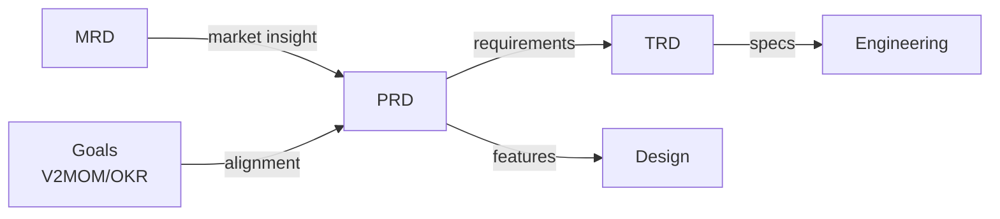

# Document Types Overview

Structured Requirements supports three core document types, each serving a different purpose in the product development lifecycle.

## Document Comparison

| Aspect | PRD | MRD | TRD |
|--------|-----|-----|-----|
| **Full Name** | Product Requirements Document | Market Requirements Document | Technical Requirements Document |
| **Primary Owner** | Product Manager | Product Marketing | Technical Lead |
| **Focus** | What to build and why | Market opportunity and positioning | How to build it |
| **Audience** | Engineering, Design, QA | Sales, Marketing, Executives | Engineering, DevOps |
| **Timing** | Before development | Before/during PRD | After PRD approval |

## When to Use Each

### PRD (Product Requirements Document)

Use a PRD when you need to:

- Define product features and requirements
- Document user personas and their needs
- Specify success metrics
- Track risks and assumptions
- Align with strategic goals (V2MOM/OKR)

**Key sections:** Executive Summary, Personas, User Stories, Requirements, Roadmap

### MRD (Market Requirements Document)

Use an MRD when you need to:

- Analyze market opportunity
- Define target market segments
- Document competitive landscape
- Establish go-to-market strategy
- Define pricing and positioning

**Key sections:** Market Analysis, Buyer Personas, Competitive Analysis, GTM Strategy

### TRD (Technical Requirements Document)

Use a TRD when you need to:

- Document system architecture
- Define API specifications
- Specify security requirements
- Plan infrastructure and scaling
- Document integration points

**Key sections:** Architecture Overview, API Specs, Security, Infrastructure

## Document Flow



## Typical Workflow

1. **Market Analysis** (MRD) - Identify opportunity and target market
2. **Goal Setting** (V2MOM/OKR) - Define strategic objectives
3. **Product Definition** (PRD) - Specify what to build
4. **Technical Planning** (TRD) - Plan how to build it
5. **Implementation** - Build and ship

## Package Imports

```go
import (
    "github.com/grokify/structured-plan/prd"  // Product requirements
    "github.com/grokify/structured-plan/mrd"  // Market requirements
    "github.com/grokify/structured-plan/trd"  // Technical requirements
)
```

## JSON File Conventions

| Document | Default Filename | Extension |
|----------|-----------------|-----------|
| PRD | `prd.json` | `.prd.json` |
| MRD | `mrd.json` | `.mrd.json` |
| TRD | `trd.json` | `.trd.json` |

## Next Steps

- [PRD Documentation](prd.md)
- [MRD Documentation](mrd.md)
- [TRD Documentation](trd.md)
