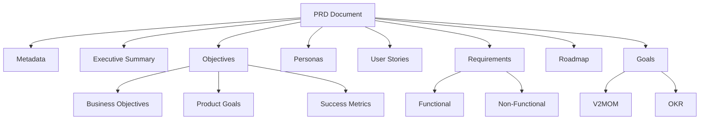

# PRD (Product Requirements Document)

The PRD is the core document type in structured-requirements, defining what to build and why.

## Structure



## Core Sections

### Metadata

```go
type Metadata struct {
    ID        string     `json:"id"`
    Title     string     `json:"title"`
    Version   string     `json:"version"`
    Status    Status     `json:"status"`
    CreatedAt time.Time  `json:"created_at"`
    UpdatedAt time.Time  `json:"updated_at"`
    Authors   []Person   `json:"authors"`
    Reviewers []Person   `json:"reviewers,omitempty"`
    Approvers []Approver `json:"approvers,omitempty"`
    Tags      []string   `json:"tags,omitempty"`
}
```

**Status values:** `draft`, `in_review`, `approved`, `deprecated`

### Executive Summary

```go
type ExecutiveSummary struct {
    ProblemStatement  string   `json:"problem_statement"`
    ProposedSolution  string   `json:"proposed_solution"`
    ExpectedOutcomes  []string `json:"expected_outcomes"`
    TargetAudience    string   `json:"target_audience,omitempty"`
    ValueProposition  string   `json:"value_proposition,omitempty"`
}
```

### Objectives

```go
type Objectives struct {
    BusinessObjectives []Objective     `json:"business_objectives"`
    ProductGoals       []Objective     `json:"product_goals"`
    SuccessMetrics     []SuccessMetric `json:"success_metrics"`
}

type Objective struct {
    ID          string `json:"id"`
    Description string `json:"description"`
    Rationale   string `json:"rationale,omitempty"`
    AlignedWith string `json:"aligned_with,omitempty"` // V2MOM/OKR reference
}

type SuccessMetric struct {
    ID                string `json:"id"`
    Name              string `json:"name"`
    Description       string `json:"description"`
    Metric            string `json:"metric"`
    Target            string `json:"target"`
    CurrentBaseline   string `json:"current_baseline,omitempty"`
    MeasurementMethod string `json:"measurement_method,omitempty"`
}
```

### Personas

```go
type Persona struct {
    ID                   string               `json:"id"`
    Name                 string               `json:"name"`
    Role                 string               `json:"role"`
    IsPrimary            bool                 `json:"is_primary"`
    Description          string               `json:"description,omitempty"`
    Goals                []string             `json:"goals"`
    PainPoints           []string             `json:"pain_points"`
    TechnicalProficiency TechnicalProficiency `json:"technical_proficiency,omitempty"`
    Demographics         *Demographics        `json:"demographics,omitempty"`
}
```

### Requirements

```go
type Requirements struct {
    Functional    []FunctionalRequirement    `json:"functional"`
    NonFunctional []NonFunctionalRequirement `json:"non_functional"`
}

type FunctionalRequirement struct {
    ID               string   `json:"id"`
    Title            string   `json:"title"`
    Description      string   `json:"description"`
    Priority         Priority `json:"priority"`
    MoSCoW           MoSCoW   `json:"moscow,omitempty"`
    AcceptanceCriteria []string `json:"acceptance_criteria,omitempty"`
    PersonaIDs       []string `json:"persona_ids,omitempty"`
}
```

**Priority:** `critical`, `high`, `medium`, `low`

**MoSCoW:** `must`, `should`, `could`, `wont`

**NFR Categories:** `performance`, `scalability`, `reliability`, `availability`, `security`, `multi_tenancy`, `observability`, `maintainability`, `usability`, `compatibility`, `compliance`

## Optional Sections

### Goals Alignment

```go
type GoalsAlignment struct {
    V2MOMRef          *GoalReference    `json:"v2mom_ref,omitempty"`
    V2MOM             *v2mom.V2MOM      `json:"v2mom,omitempty"`
    OKRRef            *GoalReference    `json:"okr_ref,omitempty"`
    OKR               *okr.OKRDocument  `json:"okr,omitempty"`
    AlignedObjectives map[string]string `json:"aligned_objectives,omitempty"`
}
```

### Problem Definition (Extended)

```go
type ProblemDefinition struct {
    Statement       string     `json:"statement"`
    Impact          string     `json:"impact,omitempty"`
    AffectedUsers   []string   `json:"affected_users,omitempty"`
    CurrentSolution string     `json:"current_solution,omitempty"`
    Evidence        []Evidence `json:"evidence,omitempty"`
}
```

### Risks

```go
type Risk struct {
    ID          string         `json:"id"`
    Description string         `json:"description"`
    Impact      RiskImpact     `json:"impact"`
    Probability RiskProbability `json:"probability,omitempty"`
    Mitigation  string         `json:"mitigation,omitempty"`
    Status      RiskStatus     `json:"status,omitempty"`
}
```

## Creating a PRD

### Minimal PRD

```go
doc := prd.New("PRD-001", "My Product",
    prd.Person{Name: "Author Name"})

doc.ExecutiveSummary.ProblemStatement = "Users need X"
doc.ExecutiveSummary.ProposedSolution = "Build Y"

prd.Save(doc, "my-product.prd.json")
```

### Complete PRD

```go
doc := prd.New(prd.GenerateID(), "Customer Portal",
    prd.Person{Name: "Jane Doe", Role: "PM"})

doc.ExecutiveSummary = prd.ExecutiveSummary{
    ProblemStatement: "...",
    ProposedSolution: "...",
    ExpectedOutcomes: []string{"..."},
}

doc.Personas = []prd.Persona{{...}}
doc.Objectives = prd.Objectives{...}
doc.Requirements = prd.Requirements{...}
doc.Roadmap = prd.Roadmap{...}
doc.Risks = []prd.Risk{{...}}

// Optional: Add goals alignment
doc.Goals = &prd.GoalsAlignment{
    OKR: &okr.OKRDocument{...},
}

prd.Save(doc, "customer-portal.prd.json")
```

## Validation

```go
result := prd.Validate(doc)

if !result.Valid {
    for _, err := range result.Errors {
        fmt.Printf("Error: %s - %s\n", err.Field, err.Message)
    }
}

for _, warn := range result.Warnings {
    fmt.Printf("Warning: %s - %s\n", warn.Field, warn.Message)
}
```

## Scoring

```go
scores := prd.Score(doc)

fmt.Printf("Overall: %.0f%%\n", scores.OverallScore*100)
fmt.Printf("Decision: %s\n", scores.Decision)  // approve, revise, reject

for _, cat := range scores.CategoryScores {
    fmt.Printf("%s: %.0f%% (weight: %.0f%%)\n",
        cat.Category, cat.Score*100, cat.Weight*100)
}
```

## Views

| View | Function | Output |
|------|----------|--------|
| PM View | `GeneratePMView(doc)` | Detailed view for product managers |
| Exec View | `GenerateExecView(doc, scores)` | Summary for executives |
| 6-Pager | `GenerateSixPagerView(doc)` | Amazon-style narrative |
| PR/FAQ | `GeneratePRFAQView(doc)` | Press release + FAQ |

## JSON Example

```json
{
  "metadata": {
    "id": "PRD-2025-022",
    "title": "Customer Portal Redesign",
    "version": "1.0.0",
    "status": "draft",
    "authors": [{"name": "Jane Doe", "role": "PM"}]
  },
  "executive_summary": {
    "problem_statement": "Current portal has 40% bounce rate",
    "proposed_solution": "Modern responsive redesign",
    "expected_outcomes": ["Reduce bounce rate to <20%"]
  },
  "objectives": {
    "business_objectives": [
      {"id": "BO-1", "description": "Increase retention by 15%"}
    ],
    "product_goals": [
      {"id": "PG-1", "description": "90% task success rate"}
    ],
    "success_metrics": [
      {"id": "SM-1", "name": "Bounce Rate", "target": "<20%"}
    ]
  },
  "personas": [...],
  "requirements": {...},
  "goals": {
    "okr": {...},
    "aligned_objectives": {"BO-1": "O1"}
  }
}
```

## Next Steps

- [Views Documentation](../views/pm-view.md)
- [Scoring](../features/scoring.md)
- [Goals Integration](../goals/overview.md)
