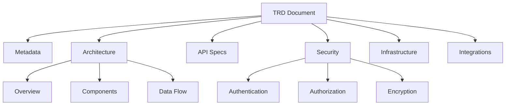

# TRD (Technical Requirements Document)

The TRD specifies how to build the product defined in the PRD.

## Purpose

A TRD answers:

- What is the system architecture?
- How will components communicate?
- What are the API specifications?
- How will security be implemented?
- What infrastructure is required?

## Structure



## Core Sections

### Architecture Overview

```go
type Architecture struct {
    Overview      string           `json:"overview"`
    Diagram       string           `json:"diagram,omitempty"`      // URL or base64
    Components    []Component      `json:"components"`
    DataFlow      []DataFlow       `json:"data_flow,omitempty"`
    Patterns      []string         `json:"patterns,omitempty"`     // e.g., "microservices", "event-driven"
    Constraints   []string         `json:"constraints,omitempty"`
}

type Component struct {
    ID           string   `json:"id"`
    Name         string   `json:"name"`
    Type         string   `json:"type"`          // Service, Database, Queue, etc.
    Description  string   `json:"description"`
    Technology   string   `json:"technology"`
    Dependencies []string `json:"dependencies,omitempty"`
    Owner        string   `json:"owner,omitempty"`
}
```

### API Specifications

```go
type APISpec struct {
    ID          string      `json:"id"`
    Name        string      `json:"name"`
    Version     string      `json:"version"`
    Type        string      `json:"type"`         // REST, GraphQL, gRPC
    BaseURL     string      `json:"base_url,omitempty"`
    Endpoints   []Endpoint  `json:"endpoints"`
    Auth        string      `json:"auth"`         // OAuth2, API Key, JWT
    RateLimit   string      `json:"rate_limit,omitempty"`
}

type Endpoint struct {
    Method      string            `json:"method"`
    Path        string            `json:"path"`
    Description string            `json:"description"`
    Request     *RequestSpec      `json:"request,omitempty"`
    Response    *ResponseSpec     `json:"response,omitempty"`
    Errors      []ErrorSpec       `json:"errors,omitempty"`
}
```

### Security Requirements

```go
type Security struct {
    Authentication  AuthConfig      `json:"authentication"`
    Authorization   AuthzConfig     `json:"authorization"`
    Encryption      EncryptionSpec  `json:"encryption"`
    Compliance      []string        `json:"compliance,omitempty"`    // GDPR, SOC2, HIPAA
    Vulnerabilities []string        `json:"vulnerabilities,omitempty"`
    Audit           *AuditSpec      `json:"audit,omitempty"`
}

type AuthConfig struct {
    Method      string   `json:"method"`       // OAuth2, SAML, OIDC
    Providers   []string `json:"providers"`
    MFA         bool     `json:"mfa"`
    SessionTTL  string   `json:"session_ttl"`
}

type EncryptionSpec struct {
    AtRest      string `json:"at_rest"`      // AES-256
    InTransit   string `json:"in_transit"`   // TLS 1.3
    KeyManagement string `json:"key_management,omitempty"`
}
```

### Infrastructure

```go
type Infrastructure struct {
    Cloud       string          `json:"cloud"`          // AWS, GCP, Azure
    Regions     []string        `json:"regions"`
    Compute     []ComputeSpec   `json:"compute"`
    Storage     []StorageSpec   `json:"storage"`
    Networking  NetworkSpec     `json:"networking"`
    Scaling     ScalingSpec     `json:"scaling"`
    Monitoring  MonitoringSpec  `json:"monitoring"`
}

type ScalingSpec struct {
    Type        string `json:"type"`         // Horizontal, Vertical
    MinInstances int   `json:"min_instances"`
    MaxInstances int   `json:"max_instances"`
    Triggers    []string `json:"triggers"`
}
```

### Integrations

```go
type Integration struct {
    ID          string `json:"id"`
    Name        string `json:"name"`
    Type        string `json:"type"`          // API, Webhook, Queue, File
    Direction   string `json:"direction"`     // Inbound, Outbound, Bidirectional
    Protocol    string `json:"protocol"`
    DataFormat  string `json:"data_format"`   // JSON, XML, Protobuf
    Frequency   string `json:"frequency,omitempty"`
    SLA         string `json:"sla,omitempty"`
}
```

## Creating a TRD

```go
import "github.com/grokify/structured-requirements/trd"

doc := &trd.Document{
    Metadata: trd.Metadata{
        ID:       "TRD-2025-001",
        Title:    "Customer Portal Technical Design",
        Version:  "1.0.0",
        Status:   trd.StatusDraft,
        PRDRef:   "PRD-2025-001",  // Link to parent PRD
    },
    Architecture: trd.Architecture{
        Overview: "Microservices architecture with React frontend",
        Patterns: []string{"microservices", "event-driven", "CQRS"},
        Components: []trd.Component{
            {
                ID:          "api-gateway",
                Name:        "API Gateway",
                Type:        "Service",
                Technology:  "Kong",
            },
            {
                ID:          "user-service",
                Name:        "User Service",
                Type:        "Service",
                Technology:  "Go",
            },
        },
    },
    APISpecs: []trd.APISpec{
        {
            ID:      "user-api",
            Name:    "User API",
            Version: "v1",
            Type:    "REST",
            Auth:    "OAuth2",
            Endpoints: []trd.Endpoint{
                {
                    Method:      "GET",
                    Path:        "/users/{id}",
                    Description: "Get user by ID",
                },
            },
        },
    },
    Security: trd.Security{
        Authentication: trd.AuthConfig{
            Method:    "OAuth2",
            Providers: []string{"Google", "Microsoft"},
            MFA:       true,
        },
        Encryption: trd.EncryptionSpec{
            AtRest:    "AES-256",
            InTransit: "TLS 1.3",
        },
        Compliance: []string{"SOC2", "GDPR"},
    },
}

trd.Save(doc, "portal-trd.trd.json")
```

## Validation

```go
result := trd.Validate(doc)
if !result.Valid {
    for _, err := range result.Errors {
        fmt.Printf("Error: %s\n", err.Message)
    }
}
```

## JSON Example

```json
{
  "metadata": {
    "id": "TRD-2025-001",
    "title": "Customer Portal Technical Design",
    "version": "1.0.0",
    "prd_ref": "PRD-2025-001"
  },
  "architecture": {
    "overview": "Microservices architecture with React frontend",
    "patterns": ["microservices", "event-driven"],
    "components": [
      {
        "id": "api-gateway",
        "name": "API Gateway",
        "type": "Service",
        "technology": "Kong"
      }
    ]
  },
  "api_specs": [
    {
      "id": "user-api",
      "name": "User API",
      "type": "REST",
      "auth": "OAuth2",
      "endpoints": [
        {"method": "GET", "path": "/users/{id}"}
      ]
    }
  ],
  "security": {
    "authentication": {
      "method": "OAuth2",
      "mfa": true
    },
    "encryption": {
      "at_rest": "AES-256",
      "in_transit": "TLS 1.3"
    },
    "compliance": ["SOC2", "GDPR"]
  },
  "infrastructure": {
    "cloud": "AWS",
    "regions": ["us-east-1", "eu-west-1"]
  }
}
```

## PRD to TRD Flow

| PRD Section | TRD Section |
|-------------|-------------|
| Functional Requirements | API Endpoints |
| Non-Functional (Performance) | Scaling, Infrastructure |
| Non-Functional (Security) | Security Config |
| Non-Functional (Compliance) | Compliance Requirements |
| Technical Architecture | Architecture Components |

## Next Steps

- [PRD Documentation](prd.md)
- [MRD Documentation](mrd.md)
