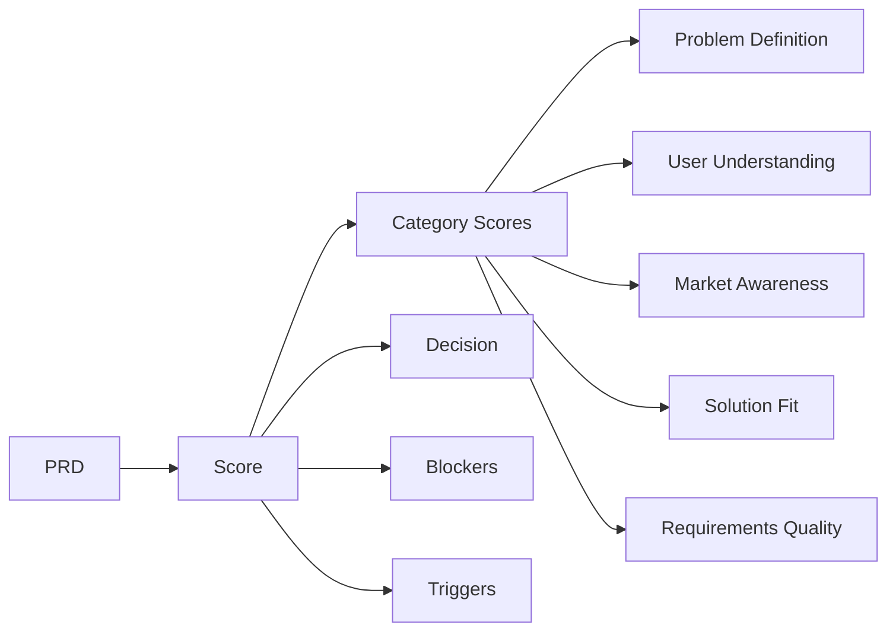

# Scoring & Validation

The scoring system evaluates PRD quality across multiple dimensions and provides actionable feedback.

## Overview



## Quick Start

```go
import "github.com/grokify/structured-plan/prd"

// Score a PRD
scores := prd.Score(doc)

fmt.Printf("Overall Score: %.0f%%\n", scores.OverallScore*100)
fmt.Printf("Decision: %s\n", scores.Decision)

for _, cat := range scores.CategoryScores {
    fmt.Printf("%s: %.0f%%\n", cat.Category, cat.Score*100)
}
```

## Scoring Categories

| Category | Weight | What It Measures |
|----------|--------|------------------|
| Problem Definition | 25% | Clarity and evidence of problem |
| User Understanding | 20% | Persona depth and pain points |
| Market Awareness | 15% | Competitive and market analysis |
| Solution Fit | 20% | Solution addresses problem |
| Requirements Quality | 20% | Clear, testable requirements |

## Decision Outcomes

| Score | Decision | Meaning |
|-------|----------|---------|
| ≥80% | **APPROVE** | Ready for development |
| 60-79% | **REVISE** | Needs improvements |
| <60% | **REJECT** | Significant rework needed |

## ScoringResult Structure

```go
type ScoringResult struct {
    OverallScore   float64         `json:"overall_score"`   // 0.0-1.0
    Decision       ReviewDecision  `json:"decision"`        // approve, revise, reject
    CategoryScores []CategoryScore `json:"category_scores"`
    Blockers       []Blocker       `json:"blockers,omitempty"`
    Triggers       []RevisionTrigger `json:"triggers,omitempty"`
    Justification  string          `json:"justification,omitempty"`
}

type CategoryScore struct {
    Category      string  `json:"category"`
    Score         float64 `json:"score"`
    Weight        float64 `json:"weight"`
    Justification string  `json:"justification,omitempty"`
}
```

## Category Details

### Problem Definition (25%)

Evaluates:

- Problem statement clarity
- Impact quantification
- Evidence and data
- Affected user identification

```go
// High score example
doc.ExecutiveSummary.ProblemStatement = "40% bounce rate costs $2M ARR annually"
doc.Problem = &prd.ProblemDefinition{
    Statement: "...",
    Impact:    "...",
    Evidence:  []prd.Evidence{{Type: "analytics", Source: "..."}},
}
```

### User Understanding (20%)

Evaluates:

- Persona completeness
- Pain points specificity
- Goals clarity
- Demographics (if relevant)

```go
// High score example
doc.Personas = []prd.Persona{
    {
        Name:       "Power User",
        Role:       "Account Manager",
        IsPrimary:  true,
        Goals:      []string{"Quick data access", "Report generation"},
        PainPoints: []string{"15 min per task", "4+ clicks to complete"},
    },
}
```

### Market Awareness (15%)

Evaluates:

- Competitive analysis
- Market alternatives
- Differentiation
- Timing rationale

### Solution Fit (20%)

Evaluates:

- Solution addresses stated problem
- Feature alignment with pain points
- Scope discipline
- Technical feasibility

### Requirements Quality (20%)

Evaluates:

- Clear acceptance criteria
- Measurable targets
- Priority assignment
- Testability

## Blockers

Blockers are critical issues that override the score:

```go
type Blocker struct {
    Category    string `json:"category"`
    Description string `json:"description"`
    Severity    string `json:"severity"`  // critical, high
}
```

If blockers exist, decision becomes **REJECT** regardless of score.

```go
if len(scores.Blockers) > 0 {
    // Decision will be REJECT
    for _, b := range scores.Blockers {
        fmt.Printf("BLOCKER: %s - %s\n", b.Category, b.Description)
    }
}
```

## Revision Triggers

Triggers suggest specific improvements:

```go
type RevisionTrigger struct {
    Category   string `json:"category"`
    Issue      string `json:"issue"`
    Suggestion string `json:"suggestion"`
    Severity   string `json:"severity"`  // critical, high, medium, low
}
```

```go
for _, t := range scores.Triggers {
    fmt.Printf("[%s] %s: %s\n", t.Severity, t.Issue, t.Suggestion)
}
```

## Custom Weights

Override default category weights:

```go
weights := []prd.CategoryWeight{
    {Category: "problem_definition", Weight: 0.30},  // Increased
    {Category: "user_understanding", Weight: 0.20},
    {Category: "market_awareness", Weight: 0.10},    // Decreased
    {Category: "solution_fit", Weight: 0.20},
    {Category: "requirements_quality", Weight: 0.20},
}

// Apply custom weights
scores := prd.ScoreWithWeights(doc, weights)
```

## Validation vs Scoring

| Validation | Scoring |
|------------|---------|
| Binary (valid/invalid) | Continuous (0-100%) |
| Required fields | Quality assessment |
| Fast | More thorough |
| Schema compliance | Content evaluation |

```go
// Validation - checks structure
result := prd.Validate(doc)
if !result.Valid {
    // Handle errors
}

// Scoring - evaluates quality
scores := prd.Score(doc)
if scores.Decision == prd.ReviewReject {
    // Handle rejection
}
```

## Best Practices

!!! tip "Improving Scores"
    1. **Problem Definition**: Include data and impact
    2. **User Understanding**: 2-3 detailed personas
    3. **Market Awareness**: Document alternatives
    4. **Solution Fit**: Link features to pain points
    5. **Requirements**: Add acceptance criteria

!!! warning "Common Issues"
    - Vague problem statements → Low problem score
    - Missing personas → Low user score
    - No competitive analysis → Low market score
    - Features don't match problems → Low solution score

## Integration with Views

Scoring feeds into Executive View:

```go
scores := prd.Score(doc)
execView := prd.GenerateExecView(doc, scores)

// Exec view includes scoring summary
fmt.Println(execView.Decision)      // From scores
fmt.Println(execView.Confidence)    // Derived from scores
fmt.Println(execView.ScoreSummary)  // Category breakdown
```

## Next Steps

- [Completeness Check](completeness.md)
- [Executive View](../views/exec-view.md)
- [PRD Documentation](../documents/prd.md)
