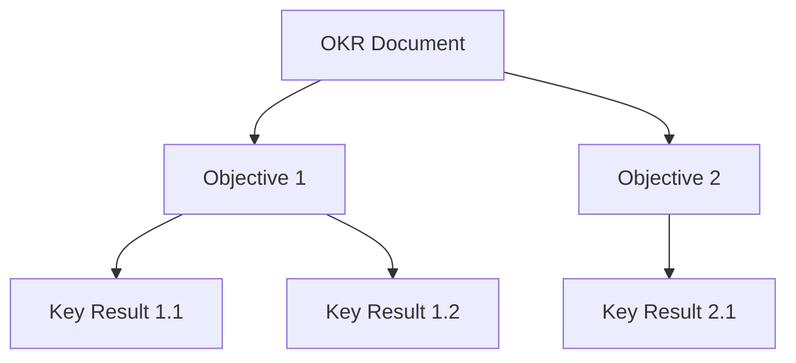

# OKR Integration

OKR (Objectives and Key Results) is a goal-setting framework popularized by Intel and Google.

## OKR Structure



| Component | Purpose | Characteristics |
|-----------|---------|-----------------|
| **Objective** | What you want to achieve | Qualitative, inspirational |
| **Key Result** | How you measure success | Quantitative, measurable |

## OKR Scoring

OKRs use a 0.0-1.0 scoring scale:

| Score | Grade | Meaning |
|-------|-------|---------|
| 0.9-1.0 | A | Exceeded expectations |
| 0.7-0.89 | B | Achieved target (success) |
| 0.4-0.69 | C | Partial achievement |
| 0.2-0.39 | D | Below expectations |
| 0.0-0.19 | F | Not achieved |

!!! note "0.7 is Success"
    In OKR methodology, achieving 70% is considered a success. Setting ambitious goals means 100% achievement is rare.

## OKR Types

```go
import "github.com/grokify/structured-goals/okr"

type OKRDocument struct {
    Schema     string       `json:"$schema,omitempty"`
    Metadata   *Metadata    `json:"metadata,omitempty"`
    Theme      string       `json:"theme,omitempty"`
    Objectives []Objective  `json:"objectives"`
    Risks      []Risk       `json:"risks,omitempty"`
}

type Objective struct {
    ID          string      `json:"id,omitempty"`
    Title       string      `json:"title"`
    Description string      `json:"description,omitempty"`
    Owner       string      `json:"owner,omitempty"`
    KeyResults  []KeyResult `json:"keyResults"`
    Progress    float64     `json:"progress,omitempty"`  // Calculated
}

type KeyResult struct {
    ID         string  `json:"id,omitempty"`
    Title      string  `json:"title"`
    Metric     string  `json:"metric,omitempty"`
    Baseline   string  `json:"baseline,omitempty"`
    Target     string  `json:"target,omitempty"`
    Current    string  `json:"current,omitempty"`
    Score      float64 `json:"score,omitempty"`       // 0.0-1.0
    Confidence string  `json:"confidence,omitempty"`  // Low, Medium, High
}
```

## PRD Integration

### Reference External OKR

```go
doc.Goals = &prd.GoalsAlignment{
    OKRRef: &prd.GoalReference{
        ID:      "OKR-2025-Q1",
        Path:    "./goals/2025-q1.okr.json",
        Version: "1.0.0",
    },
    AlignedObjectives: map[string]string{
        "BO-1": "O1",      // Business Objective -> OKR Objective
        "PG-1": "O2",      // Product Goal -> OKR Objective
        "SM-1": "O1-KR1",  // Success Metric -> Key Result
    },
}
```

### Embed OKR in PRD

```go
doc.Goals = &prd.GoalsAlignment{
    OKR: &okr.OKRDocument{
        Metadata: &okr.Metadata{
            Name:   "Q1 2025 Product OKRs",
            Period: "2025-Q1",
            Owner:  "Product Team",
        },
        Theme: "Customer Experience Excellence",
        Objectives: []okr.Objective{
            {
                ID:    "O1",
                Title: "Improve customer self-service",
                Owner: "Jane Doe",
                KeyResults: []okr.KeyResult{
                    {
                        ID:     "O1-KR1",
                        Title:  "Reduce support tickets by 30%",
                        Target: "-30%",
                        Score:  0.0,
                    },
                    {
                        ID:     "O1-KR2",
                        Title:  "Achieve 80% portal adoption",
                        Target: "80%",
                        Score:  0.0,
                    },
                },
            },
        },
    },
    AlignedObjectives: map[string]string{
        "BO-1": "O1",
        "SM-1": "O1-KR1",
    },
}
```

## Mapping PRD to OKR

| PRD Element | OKR Element |
|-------------|-------------|
| Business Objective | Objective |
| Product Goal | Objective |
| Success Metric | Key Result |
| Target value | Key Result target |
| Current baseline | Key Result baseline |

## Progress Calculation

```go
// Calculate objective progress from key results
obj.UpdateProgress()  // Sets obj.Progress

// Calculate document progress
progress := doc.CalculateOverallProgress()

// Get score grade
grade := okr.ScoreGrade(0.75)  // "B"
desc := okr.ScoreDescription(0.75)  // "Achieved target"
```

## Validation

```go
errs := doc.Goals.OKR.Validate(okr.DefaultValidationOptions())

if !okr.IsValid(errs) {
    for _, e := range okr.Errors(errs) {
        fmt.Printf("Error: %s - %s\n", e.Path, e.Message)
    }
}
```

### Validation Options

```go
opts := &okr.ValidationOptions{
    RequireKeyResults:   true,  // Each objective must have KRs
    RequireScores:       false, // Scores not required initially
    MinKeyResultsPerObj: 2,     // At least 2 KRs per objective
    MaxKeyResultsPerObj: 5,     // At most 5 KRs per objective
    MaxObjectives:       5,     // At most 5 objectives
    RequireTargets:      true,  // KRs must have targets
    ValidateScoreRange:  true,  // Scores must be 0.0-1.0
}
```

## Example OKR JSON

```json
{
  "metadata": {
    "id": "OKR-2025-Q1",
    "name": "Q1 2025 Product OKRs",
    "period": "2025-Q1",
    "owner": "Product Team",
    "status": "Active"
  },
  "theme": "Customer Experience Excellence",
  "objectives": [
    {
      "id": "O1",
      "title": "Improve customer self-service experience",
      "owner": "Jane Doe",
      "keyResults": [
        {
          "id": "O1-KR1",
          "title": "Reduce support tickets by 30%",
          "metric": "support_tickets",
          "baseline": "1000/month",
          "target": "700/month",
          "current": "850/month",
          "score": 0.5,
          "confidence": "Medium"
        },
        {
          "id": "O1-KR2",
          "title": "Achieve 80% portal adoption rate",
          "metric": "portal_adoption",
          "baseline": "40%",
          "target": "80%",
          "current": "65%",
          "score": 0.625,
          "confidence": "High"
        }
      ],
      "progress": 0.5625
    },
    {
      "id": "O2",
      "title": "Launch new analytics dashboard",
      "owner": "Bob Smith",
      "keyResults": [
        {
          "id": "O2-KR1",
          "title": "Complete beta with 50 customers",
          "target": "50 customers",
          "score": 0.0
        }
      ]
    }
  ],
  "risks": [
    {
      "title": "Resource constraints",
      "impact": "Medium",
      "mitigation": "Prioritize critical features"
    }
  ]
}
```

## Best Practices

### Writing Good Objectives

- **Qualitative** - Describe the outcome, not the metric
- **Inspirational** - Motivate the team
- **Achievable** - Challenging but realistic
- **Time-bound** - Typically quarterly

!!! tip "Good Objective Examples"
    - "Delight customers with instant support"
    - "Build the fastest checkout experience"
    - "Become the trusted partner for enterprise clients"

### Writing Good Key Results

- **Measurable** - Specific numbers
- **Outcome-focused** - Not activities
- **Stretch goals** - 70% achievement = success
- **3-5 per objective** - Keep focused

!!! tip "Good Key Result Examples"
    - "Reduce page load time from 3s to 1s"
    - "Increase NPS from 40 to 60"
    - "Achieve 99.9% uptime"

## Next Steps

- [V2MOM Integration](v2mom.md)
- [Goals Overview](overview.md)
