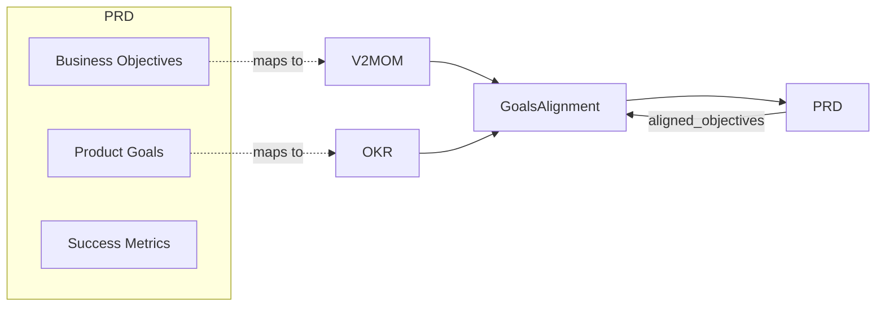

# Goals Integration Overview

Structured Requirements supports alignment with strategic goal frameworks through the `structured-goals` package.

## Supported Frameworks

| Framework | Description | Best For |
|-----------|-------------|----------|
| **V2MOM** | Vision, Values, Methods, Obstacles, Measures | Company/team strategic planning |
| **OKR** | Objectives and Key Results | Quarterly goal setting |

## Why Integrate Goals?

Connecting PRDs to strategic goals provides:

- **Traceability** - Link features to business objectives
- **Alignment** - Ensure work supports company strategy
- **Prioritization** - Use goal priority to guide decisions
- **Measurement** - Connect success metrics to KRs

## Integration Architecture



## GoalsAlignment Structure

```go
type GoalsAlignment struct {
    // Reference external V2MOM
    V2MOMRef *GoalReference `json:"v2mom_ref,omitempty"`

    // Embed V2MOM directly
    V2MOM *v2mom.V2MOM `json:"v2mom,omitempty"`

    // Reference external OKR
    OKRRef *GoalReference `json:"okr_ref,omitempty"`

    // Embed OKR directly
    OKR *okr.OKRDocument `json:"okr,omitempty"`

    // Map PRD objectives to goal IDs
    AlignedObjectives map[string]string `json:"aligned_objectives,omitempty"`
}
```

## Two Integration Modes

### 1. Reference Mode

Link to external goal documents:

```go
doc.Goals = &prd.GoalsAlignment{
    V2MOMRef: &prd.GoalReference{
        ID:      "V2MOM-FY2025",
        Path:    "../goals/fy2025-v2mom.json",
        Version: "1.0.0",
    },
    AlignedObjectives: map[string]string{
        "BO-1": "method-1",  // Business Objective -> V2MOM Method
        "BO-2": "method-3",
    },
}
```

### 2. Embedded Mode

Include goals directly in PRD:

```go
doc.Goals = &prd.GoalsAlignment{
    OKR: &okr.OKRDocument{
        Objectives: []okr.Objective{
            {
                ID:    "O1",
                Title: "Improve customer retention",
                KeyResults: []okr.KeyResult{
                    {Title: "Reduce churn to <5%", Target: "5%"},
                },
            },
        },
    },
    AlignedObjectives: map[string]string{
        "PG-1": "O1",  // Product Goal -> OKR Objective
    },
}
```

## Alignment Mapping

The `AlignedObjectives` map connects PRD items to goals:

| PRD Item | Maps To |
|----------|---------|
| Business Objective | V2MOM Method or OKR Objective |
| Product Goal | V2MOM Method or OKR Objective |
| Success Metric | V2MOM Measure or OKR Key Result |

```go
AlignedObjectives: map[string]string{
    "BO-1":  "method-1",    // -> V2MOM Method
    "PG-1":  "O1",          // -> OKR Objective
    "SM-1":  "KR-1",        // -> OKR Key Result
}
```

## Framework Comparison

| Aspect | V2MOM | OKR |
|--------|-------|-----|
| **Scope** | Annual/multi-year | Quarterly |
| **Structure** | 5 components | 2 components |
| **Scoring** | Optional | 0.0-1.0 standard |
| **Hierarchy** | Methods → Measures | Objectives → Key Results |
| **Values** | Explicit | Not included |
| **Obstacles** | Explicit | Track as risks |

## Choosing a Framework

**Use V2MOM when:**

- Setting company or team annual strategy
- Need to define values and principles
- Want to track obstacles explicitly
- Prefer Salesforce-style planning

**Use OKR when:**

- Setting quarterly goals
- Need standardized scoring (0.0-1.0)
- Want lightweight goal tracking
- Prefer Google-style planning

**Use both when:**

- V2MOM for annual strategy
- OKR for quarterly execution

## Installation

```bash
# For goals support
go get github.com/grokify/structured-goals
```

```go
import (
    "github.com/grokify/structured-plan/prd"
    "github.com/grokify/structured-goals/v2mom"
    "github.com/grokify/structured-goals/okr"
)
```

## Next Steps

- [V2MOM Integration](v2mom.md)
- [OKR Integration](okr.md)
