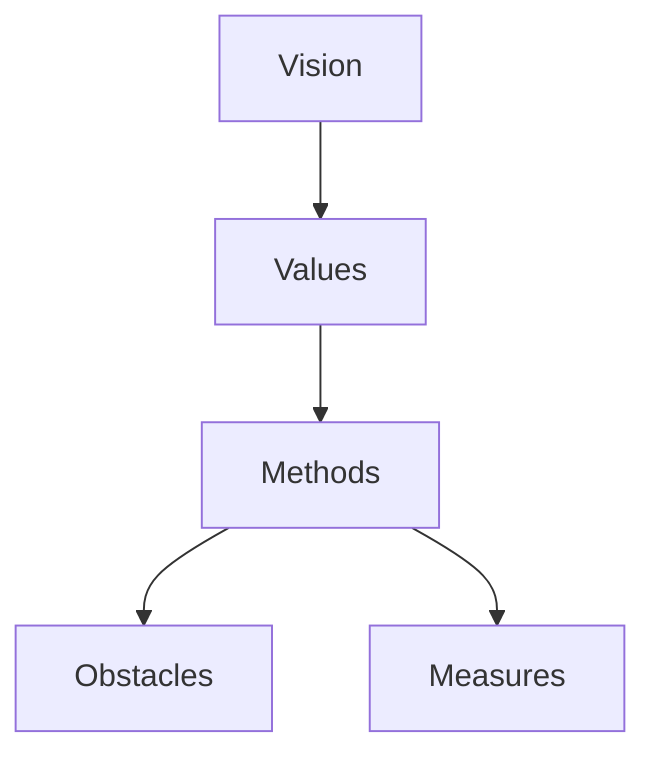

# V2MOM Integration

V2MOM (Vision, Values, Methods, Obstacles, Measures) is a strategic planning framework created by Marc Benioff at Salesforce.

## V2MOM Structure



| Component | Purpose | Example |
|-----------|---------|---------|
| **Vision** | What you want to achieve | "Be the #1 customer success platform" |
| **Values** | Guiding principles | "Customer First", "Innovation" |
| **Methods** | How you'll achieve vision | "Launch self-service portal" |
| **Obstacles** | Challenges to overcome | "Legacy system migration" |
| **Measures** | How you'll track success | "90% customer satisfaction" |

## V2MOM Types

```go
import "github.com/grokify/structured-goals/v2mom"

type V2MOM struct {
    Schema    string     `json:"$schema,omitempty"`
    Metadata  *Metadata  `json:"metadata,omitempty"`
    Vision    string     `json:"vision"`
    Values    []Value    `json:"values"`
    Methods   []Method   `json:"methods"`
    Obstacles []Obstacle `json:"obstacles,omitempty"`
    Measures  []Measure  `json:"measures,omitempty"`
}

type Method struct {
    ID          string     `json:"id,omitempty"`
    Name        string     `json:"name"`
    Description string     `json:"description,omitempty"`
    Priority    string     `json:"priority,omitempty"`  // P0, P1, P2, P3
    Status      string     `json:"status,omitempty"`
    Measures    []Measure  `json:"measures,omitempty"`   // Nested (OKR-style)
    Obstacles   []Obstacle `json:"obstacles,omitempty"`  // Nested
}

type Measure struct {
    ID       string  `json:"id,omitempty"`
    Name     string  `json:"name"`
    Target   string  `json:"target,omitempty"`
    Current  string  `json:"current,omitempty"`
    Progress float64 `json:"progress,omitempty"`  // 0.0-1.0
}
```

## Structure Modes

V2MOM supports three structure modes:

### Flat (Traditional)

Measures and obstacles at top level:

```json
{
  "vision": "...",
  "values": [...],
  "methods": [
    {"name": "Method 1"}
  ],
  "obstacles": [
    {"name": "Global obstacle"}
  ],
  "measures": [
    {"name": "Global measure"}
  ]
}
```

### Nested (OKR-aligned)

Measures nested under methods:

```json
{
  "vision": "...",
  "methods": [
    {
      "name": "Method 1",
      "measures": [
        {"name": "Method-specific measure"}
      ]
    }
  ]
}
```

### Hybrid

Both global and nested:

```json
{
  "methods": [
    {
      "name": "Method 1",
      "measures": [{"name": "Nested measure"}]
    }
  ],
  "measures": [{"name": "Global measure"}]
}
```

## PRD Integration

### Reference External V2MOM

```go
doc.Goals = &prd.GoalsAlignment{
    V2MOMRef: &prd.GoalReference{
        ID:      "V2MOM-FY2025-Engineering",
        Path:    "./goals/fy2025-engineering.v2mom.json",
        Version: "1.0.0",
    },
    AlignedObjectives: map[string]string{
        "BO-1": "method-launch-portal",
        "BO-2": "method-improve-perf",
    },
}
```

### Embed V2MOM in PRD

```go
doc.Goals = &prd.GoalsAlignment{
    V2MOM: &v2mom.V2MOM{
        Metadata: &v2mom.Metadata{
            Name:       "Customer Portal V2MOM",
            FiscalYear: "FY2025",
            Quarter:    "Q1",
        },
        Vision: "Deliver the best customer self-service experience",
        Values: []v2mom.Value{
            {Name: "Customer Obsession", Priority: 1},
            {Name: "Simplicity", Priority: 2},
        },
        Methods: []v2mom.Method{
            {
                ID:          "method-1",
                Name:        "Launch self-service portal",
                Priority:    v2mom.PriorityP0,
                Measures: []v2mom.Measure{
                    {Name: "Portal adoption rate", Target: "70%"},
                },
            },
        },
    },
    AlignedObjectives: map[string]string{
        "BO-1": "method-1",
    },
}
```

## Mapping PRD to V2MOM

| PRD Element | V2MOM Element |
|-------------|---------------|
| Business Objective | Method |
| Product Goal | Method |
| Success Metric | Measure |
| Risk | Obstacle |
| Value Proposition | Vision contribution |

## V2MOM Terminology Options

Display labels can be customized:

| Mode | Methods | Measures | Obstacles |
|------|---------|----------|-----------|
| `v2mom` | Methods | Measures | Obstacles |
| `okr` | Objectives | Key Results | Risks |
| `hybrid` | Methods (Objectives) | Measures (Key Results) | Obstacles |

```go
metadata := &v2mom.Metadata{
    Terminology: v2mom.TerminologyOKR,  // Use OKR labels
}
```

## Validation

```go
// Validate V2MOM
errs := doc.Goals.V2MOM.Validate(v2mom.DefaultValidationOptions())

errors := v2mom.Errors(errs)
warnings := v2mom.Warnings(errs)
```

## Example V2MOM JSON

```json
{
  "$schema": "https://github.com/grokify/structured-goals/schema/v2mom.schema.json",
  "metadata": {
    "name": "FY2025 Product Strategy",
    "fiscalYear": "FY2025",
    "status": "Active",
    "structure": "nested",
    "terminology": "v2mom"
  },
  "vision": "Be the most trusted platform for customer success",
  "values": [
    {"name": "Customer First", "priority": 1},
    {"name": "Innovation", "priority": 2},
    {"name": "Transparency", "priority": 3}
  ],
  "methods": [
    {
      "id": "method-portal",
      "name": "Launch Customer Portal 2.0",
      "priority": "P0",
      "status": "In Progress",
      "measures": [
        {"name": "Adoption rate", "target": "70%", "current": "45%"},
        {"name": "CSAT score", "target": "4.5", "current": "4.2"}
      ]
    }
  ],
  "obstacles": [
    {
      "name": "Legacy migration complexity",
      "severity": "High",
      "mitigation": "Phased rollout with parallel systems"
    }
  ]
}
```

## Next Steps

- [OKR Integration](okr.md)
- [Goals Overview](overview.md)
