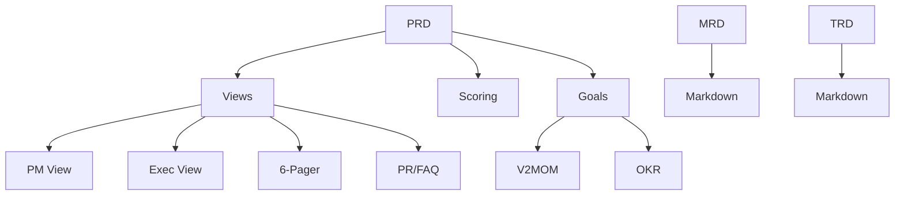
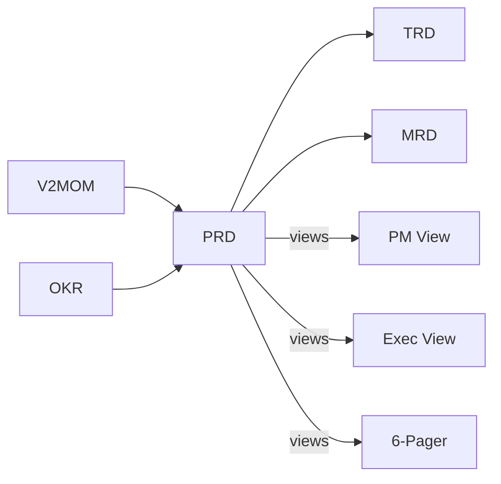

# Structured Requirements

A Go library for creating, validating, and transforming structured requirements documents.

## Overview

Structured Requirements provides typed data structures and utilities for three core document types used in product development:

| Document | Purpose | Primary Audience |
|----------|---------|------------------|
| **PRD** | Product Requirements Document | Product Managers, Engineers |
| **MRD** | Market Requirements Document | Product Marketing, Sales |
| **TRD** | Technical Requirements Document | Engineers, Architects |

## Key Features

- **Structured JSON format** - Machine-readable documents with defined schemas
- **Multiple output views** - PM View, Executive View, Amazon 6-Pager, PR/FAQ
- **Goals alignment** - Integrate with V2MOM and OKR frameworks
- **Scoring & validation** - Automated quality assessment
- **Persona library** - Reusable persona definitions across documents

## Architecture



## Quick Example

```go
package main

import (
    "fmt"
    "github.com/grokify/structured-plan/prd"
)

func main() {
    // Create a new PRD
    doc := prd.New("PRD-2025-001", "User Authentication System",
        prd.Person{Name: "Alice Smith", Role: "Product Manager"})

    // Set problem statement
    doc.ExecutiveSummary.ProblemStatement = "Users cannot securely access their accounts"
    doc.ExecutiveSummary.ProposedSolution = "Implement OAuth 2.0 authentication"

    // Score the PRD
    scores := prd.Score(doc)
    fmt.Printf("Overall Score: %.0f%%\n", scores.OverallScore*100)

    // Generate views
    pmView := prd.GeneratePMView(doc)
    markdown := prd.RenderPMMarkdown(pmView)
    fmt.Println(markdown)
}
```

## Installation

```bash
go get github.com/grokify/structured-plan
```

## Document Relationships

Structured Requirements documents can reference each other and align with strategic goals:



## Next Steps

- [Installation Guide](getting-started/installation.md)
- [Quick Start Tutorial](getting-started/quickstart.md)
- [PRD Documentation](documents/prd.md)
- [Goals Integration](goals/overview.md)
