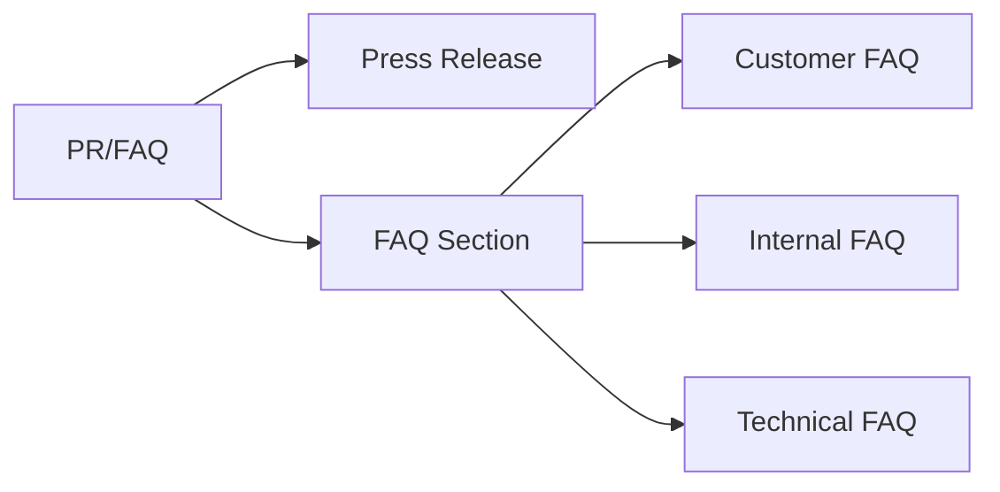

# PR/FAQ View

The PR/FAQ is a lightweight version of the 6-pager, focusing on just the Press Release and FAQ sections.

## Purpose

The PR/FAQ format is ideal for:

- Initial idea validation
- Quick stakeholder alignment
- Early-stage proposals
- Feature announcements

## Structure



## Generate PR/FAQ

```go
import "github.com/grokify/structured-requirements/prd"

prfaq := prd.GeneratePRFAQView(doc)

fmt.Println(prfaq.PressRelease.Headline)
fmt.Println(prfaq.FAQ.CustomerFAQs[0].Question)
```

## Render as Markdown

```go
markdown := prd.RenderPRFAQMarkdown(prfaq)
fmt.Println(markdown)
```

## PRFAQView Structure

```go
type PRFAQView struct {
    // Metadata
    Title   string `json:"title"`
    Version string `json:"version"`
    Author  string `json:"author"`
    Date    string `json:"date"`
    PRDID   string `json:"prd_id"`

    // The two main sections
    PressRelease PressReleaseSection `json:"press_release"`
    FAQ          FAQSection          `json:"faq"`
}
```

## Press Release Section

```go
type PressReleaseSection struct {
    Headline      string   `json:"headline"`
    Subheadline   string   `json:"subheadline,omitempty"`
    Summary       string   `json:"summary,omitempty"`
    ProblemSolved string   `json:"problem_solved"`
    Solution      string   `json:"solution"`
    Quote         Quote    `json:"quote"`
    CustomerQuote Quote    `json:"customer_quote,omitempty"`
    Benefits      []string `json:"benefits,omitempty"`
    CallToAction  string   `json:"call_to_action,omitempty"`
}

type Quote struct {
    Text    string `json:"text"`
    Speaker string `json:"speaker"`
    Role    string `json:"role,omitempty"`
}
```

## FAQ Section

```go
type FAQSection struct {
    CustomerFAQs  []FAQ `json:"customer_faqs"`   // External questions
    InternalFAQs  []FAQ `json:"internal_faqs"`   // Stakeholder questions
    TechnicalFAQs []FAQ `json:"technical_faqs"`  // Implementation questions
}

type FAQ struct {
    Question string `json:"question"`
    Answer   string `json:"answer"`
}
```

## Example Output

```markdown
# Customer Portal Redesign

**Version:** 1.0.0 | **Author:** Jane Doe | **Date:** January 22, 2025

---

## Press Release

### Acme Corp Launches Customer Portal 2.0

*New self-service platform reduces task completion time by 70%*

#### The Problem

Customers currently spend an average of 15 minutes completing simple
tasks due to slow load times and confusing navigation.

#### The Solution

Customer Portal 2.0 delivers a modern, responsive experience with
instant search, streamlined navigation, and mobile support.

> "We've reimagined how customers interact with their accounts.
> Portal 2.0 is faster, simpler, and more powerful."
>
> — Jane Doe, VP of Product

#### Key Benefits

- 70% faster page load times
- Instant search across all documents
- Full mobile support

**Get started today at portal.acme.com**

---

## Frequently Asked Questions

### External FAQ

*Questions customers and users are likely to ask.*

**Q: How do I access the new portal?**

A: Visit portal.acme.com and log in with your existing credentials.
Your account and data will be automatically migrated.

**Q: Will my saved preferences transfer?**

A: Yes, all your preferences, saved searches, and customizations
will be preserved in the new portal.

### Internal FAQ

*Questions from stakeholders, leadership, and team members.*

**Q: Why are we investing in this now?**

A: Our bounce rate has increased to 40%, directly impacting customer
satisfaction and renewal rates. Competitive pressure is also
increasing.

**Q: What's the expected ROI?**

A: We project a 15% improvement in customer retention, translating
to approximately $2M in preserved ARR.

### Technical FAQ

*Questions about implementation and architecture.*

**Q: What technology stack are we using?**

A: React frontend with Go backend services, deployed on Kubernetes.
```

## PR/FAQ vs 6-Pager

| Aspect | PR/FAQ | 6-Pager |
|--------|--------|---------|
| Length | ~2 pages | ~6 pages |
| Sections | 2 (PR + FAQ) | 6 (full analysis) |
| Use case | Early validation | Full proposal |
| Detail level | High-level | Comprehensive |
| Timeline | Not included | Included |
| Metrics | Brief | Detailed |

## When to Use PR/FAQ

!!! tip "Use PR/FAQ when"
    - Testing an idea before full PRD investment
    - Communicating a feature to stakeholders
    - Creating customer-facing announcements
    - Need quick alignment on direction

!!! tip "Upgrade to 6-Pager when"
    - Idea is validated and needs full analysis
    - Significant investment required
    - Multiple phases or dependencies
    - Executive approval needed

## Writing Tips

### Press Release

1. **Write from the future** - Pretend the product shipped
2. **Lead with the benefit** - Not the feature
3. **Use concrete numbers** - "70% faster" not "much faster"
4. **Include a quote** - Makes it feel real

### FAQ

1. **Be honest** - Address real concerns
2. **Anticipate skepticism** - "Why now?" "Why us?"
3. **Cover all audiences** - Customers, stakeholders, engineers
4. **Keep answers concise** - 2-3 sentences max

## Comparison with 6-Pager

The PR/FAQ reuses the same Press Release and FAQ sections as the 6-pager:

```go
// These produce identical PR and FAQ sections
prfaq := prd.GeneratePRFAQView(doc)
sixPager := prd.GenerateSixPagerView(doc)

// Same content
prfaq.PressRelease == sixPager.PressRelease  // true
prfaq.FAQ == sixPager.FAQ                     // true
```

## Next Steps

- [6-Pager](six-pager.md)
- [PM View](pm-view.md)
- [Executive View](exec-view.md)
