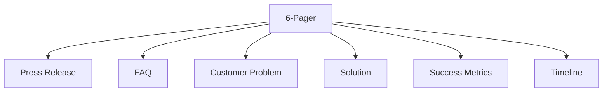

# 6-Pager View

The 6-Pager is an Amazon-style narrative document that tells the complete story of a product initiative.

## Background

The 6-pager format was pioneered by Amazon for decision-making meetings. It's a narrative document (no bullet points) that forces deep thinking and clear communication.

## Structure



| Section | Purpose | Length |
|---------|---------|--------|
| Press Release | Future-dated announcement | ~1 page |
| FAQ | Anticipated questions | ~1 page |
| Customer Problem | Deep problem analysis | ~1 page |
| Solution | How we solve it | ~1.5 pages |
| Success Metrics | How we measure | ~0.5 page |
| Timeline | Implementation plan | ~1 page |

## Generate 6-Pager

```go
import "github.com/grokify/structured-requirements/prd"

sixPager := prd.GenerateSixPagerView(doc)

// Access sections
fmt.Println(sixPager.PressRelease.Headline)
fmt.Println(sixPager.CustomerProblem.Statement)
```

## Render as Markdown

```go
markdown := prd.RenderSixPagerMarkdown(sixPager)
fmt.Println(markdown)
```

## SixPagerView Structure

```go
type SixPagerView struct {
    // Metadata
    Title   string `json:"title"`
    Version string `json:"version"`
    Author  string `json:"author"`
    Date    string `json:"date"`
    PRDID   string `json:"prd_id"`

    // The 6 sections
    PressRelease    PressReleaseSection    `json:"press_release"`
    FAQ             FAQSection             `json:"faq"`
    CustomerProblem CustomerProblemSection `json:"customer_problem"`
    Solution        SolutionSection        `json:"solution"`
    SuccessMetrics  SuccessMetricsSection  `json:"success_metrics"`
    Timeline        TimelineSection        `json:"timeline"`
}
```

## Section Details

### Press Release

Written as if announcing the finished product:

```go
type PressReleaseSection struct {
    Headline      string   `json:"headline"`
    Subheadline   string   `json:"subheadline,omitempty"`
    Summary       string   `json:"summary,omitempty"`
    ProblemSolved string   `json:"problem_solved"`
    Solution      string   `json:"solution"`
    Quote         Quote    `json:"quote"`
    CustomerQuote Quote    `json:"customer_quote,omitempty"`
    Benefits      []string `json:"benefits,omitempty"`
    CallToAction  string   `json:"call_to_action,omitempty"`
}
```

### FAQ

Anticipated questions from customers and stakeholders:

```go
type FAQSection struct {
    CustomerFAQs  []FAQ `json:"customer_faqs"`
    InternalFAQs  []FAQ `json:"internal_faqs"`
    TechnicalFAQs []FAQ `json:"technical_faqs,omitempty"`
}

type FAQ struct {
    Question string `json:"question"`
    Answer   string `json:"answer"`
}
```

### Customer Problem

Deep analysis of the problem:

```go
type CustomerProblemSection struct {
    Statement       string            `json:"statement"`
    Impact          string            `json:"impact,omitempty"`
    Personas        []PersonaSnapshot `json:"personas"`
    CurrentState    string            `json:"current_state,omitempty"`
    Evidence        []EvidenceSnapshot `json:"evidence,omitempty"`
    Alternatives    []AlternativeSnapshot `json:"alternatives,omitempty"`
}
```

### Solution

How we address the problem:

```go
type SolutionSection struct {
    Overview     string            `json:"overview"`
    KeyFeatures  []FeatureSnapshot `json:"key_features"`
    Differentiators []string       `json:"differentiators,omitempty"`
    Scope        ScopeSnapshot     `json:"scope"`
    Architecture string            `json:"architecture,omitempty"`
}
```

### Success Metrics

How we measure success:

```go
type SuccessMetricsSection struct {
    NorthStar string           `json:"north_star,omitempty"`
    Metrics   []MetricSnapshot `json:"metrics"`
}
```

### Timeline

Implementation phases:

```go
type TimelineSection struct {
    Overview string          `json:"overview,omitempty"`
    Phases   []PhaseSnapshot `json:"phases"`
    Risks    []RiskSnapshot  `json:"risks,omitempty"`
}
```

## Example Output

```markdown
# Customer Portal Redesign

**Version:** 1.0.0 | **Author:** Jane Doe | **Date:** January 22, 2025

---

## Press Release

### Introducing Customer Portal 2.0: The Fastest Way to Self-Service

*Acme Corp launches redesigned portal with 70% faster load times*

**CITY, STATE** — Acme Corp today announced the launch of Customer Portal 2.0,
a complete redesign of its self-service platform...

> "We've heard our customers loud and clear. They wanted faster, simpler
> access to their account information."
>
> — Jane Doe, VP of Product

---

## Frequently Asked Questions

### Customer FAQ

**Q: How is this different from the current portal?**

A: Portal 2.0 is built from the ground up with modern technology,
resulting in 70% faster page loads and a streamlined interface...

### Internal FAQ

**Q: Why now? What's driving this initiative?**

A: Our bounce rate has increased to 40%, directly impacting customer
satisfaction scores...

---

## Customer Problem

### The Problem

Account managers spend an average of 15 minutes per task due to slow
load times and confusing navigation...

### Who's Affected

- **Power Users** (Account Managers): Daily users who need quick access
- **Casual Users** (Customers): Monthly visitors checking statements

---

## Solution

### Overview

A modern, responsive web application built with React and optimized
for performance...

### Key Features

1. **Instant Search** - Find any document in under 2 seconds
2. **Dashboard Redesign** - Most-used actions front and center
3. **Mobile Support** - Full functionality on any device

---

## Success Metrics

| Metric | Current | Target |
|--------|---------|--------|
| Bounce Rate | 40% | <20% |
| Task Completion | 60% | >90% |
| Page Load Time | 3s | <1s |

---

## Timeline

### Phase 1: Foundation (Q1)
- Core infrastructure
- Authentication system

### Phase 2: Features (Q2)
- Dashboard redesign
- Search implementation

### Phase 3: Launch (Q3)
- Beta rollout
- Full release
```

## Best Practices

!!! tip "Writing Tips"
    - Write the press release first (Working Backwards)
    - Use concrete numbers, not vague claims
    - Include real customer quotes if available
    - FAQ should address skepticism honestly

!!! warning "Common Mistakes"
    - Using bullet points (use narrative prose)
    - Vague success metrics ("improve user experience")
    - Missing the "why now" explanation
    - Overly technical language in press release

## Next Steps

- [PR/FAQ](prfaq.md)
- [PM View](pm-view.md)
- [Executive View](exec-view.md)
